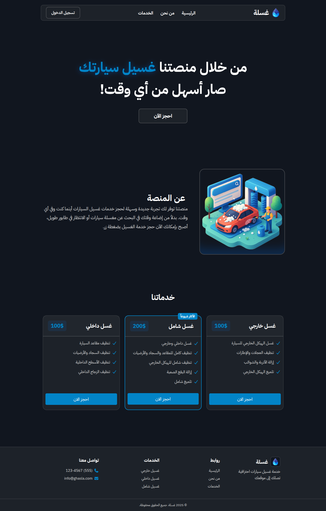

# 🚘 Ghasla - Car Wash Platform 👨‍💻

**Ghasla** is a web platform that allows users to easily book car wash services.
Users can choose the type of service, the preferred time, and the location where the service should be delivered.

## 🏆 About the Project
This project was developed as part of the **0xthon**,
hosted in the **[0x Community](https://discord.gg/E8avEhkh)** in Discord.

## 🌐 Live Demo
👉 [View Demo](https://ghasla.vercel.app)  



---

## 🗂️ Project Components

### 1. Frontend
- **Home Page**: Overview of services, offers, and main sections.
- **Booking Page**: Choose wash type (external, internal, full).
- **Time & Location Selection**: Interactive map to set user’s location.
- **Responsive Design**: Works seamlessly on mobile, tablet, and desktop.
- **Attractive & user-friendly UI**.

### 2. Backend
- **Booking Management**: Save bookings and link them to users.
- **User Management**: Register, login, and manage accounts.
- **Payment & Wallet**: Users can pay for bookings or subscribe to packages using a **virtual** balance.
- **Refunds**: If a booking is canceled, the amount is refunded back to the wallet.

### 3. Database
- Store user data, bookings, and payments.
- Track booking status (Pending, Completed, Canceled).

---

## 🧑‍💻 User Journey Example
1. The user opens the website.
2. Go to the Booking Page.
3. Chooses the wash type.
4. Selects the preferred date and time.
5. Sets their location on the map.
6. Pays using the virtual balance.
7. Receives a booking confirmation notification.

---

## 🛠️ Technologies Used
- **Frontend**: Vue.js, PureCSS  
- **Backend**: MariaDB  

## 📥 Installation & Usage
```bash
# Clone the repository
git clone https://github.com/0xAYM3N/Ghasla

# Navigate to the project directory
cd Ghasla

# Install dependencies
npm install
